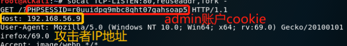

# 跨站脚本攻击(XSS)


### 实验准备

- 下载iso文件
- 使用虚拟机配置一块Host-Only网卡
- 此后, 宿同网段的虚拟机可使用虚拟机IP地址访问该漏洞网站
- 设置虚拟机root密码


### 查看密码

- ```
  cat /var/www/classes/db.php
  cat /var/www/classes/user.php
  ```

  获取用户登录时查找的数据库表格

- 登陆数据库，找到admin密码的md5哈希值，并破解


### 获得admin权限

- 获取Cookie
  
- 获得cookie后, 修改document.cookie, 则可获得管理员权限


### 实验总结

- 用户提交的数据最好加密后再展示