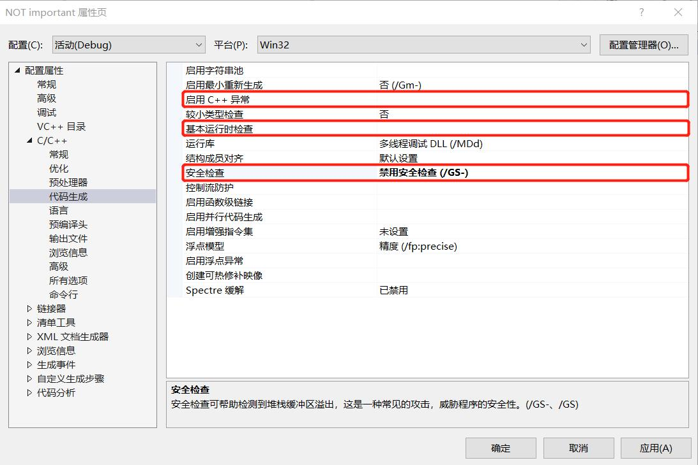
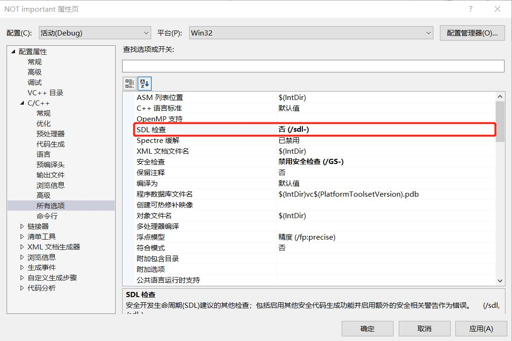
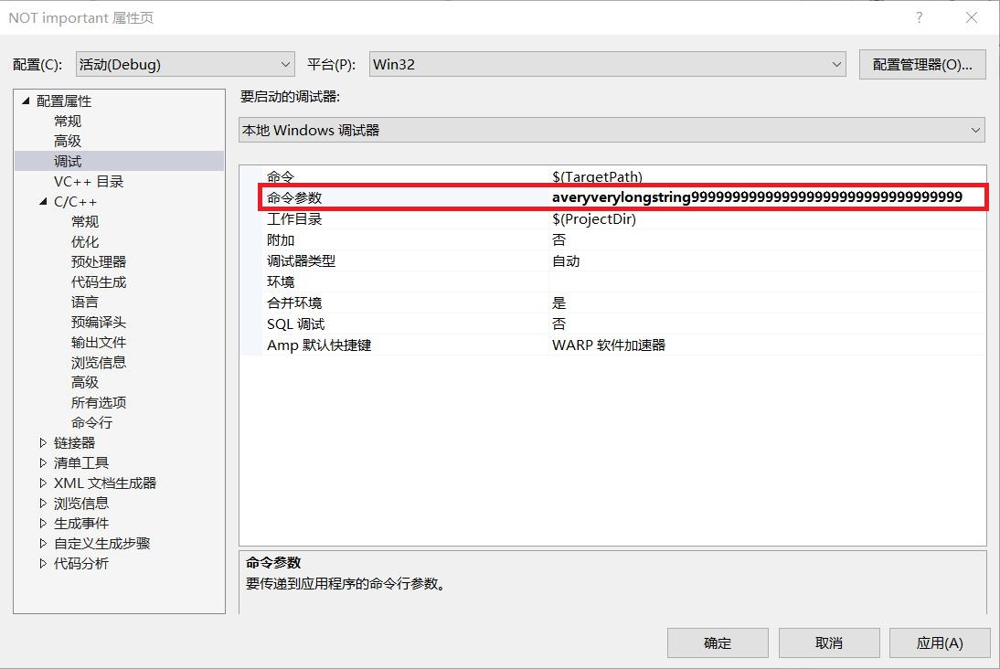
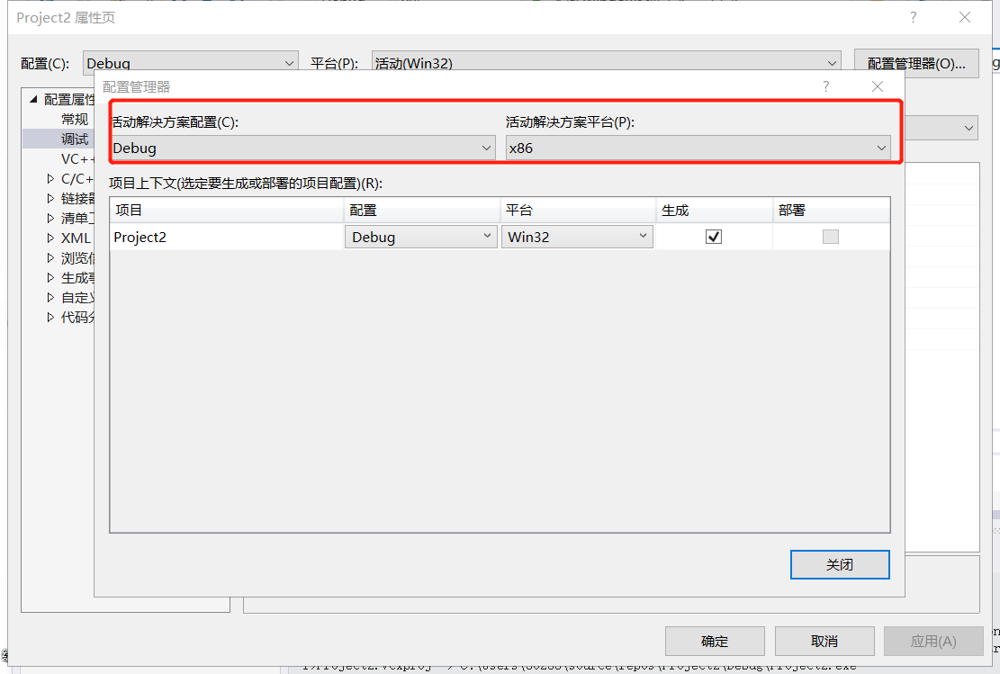

# 缓冲区溢出
### 漏洞代码

```c
#define _CRT_SECURE_NO_WARNINGS
#include <stdlib.h>
#include <stdio.h>
#include <string.h>
int sub(char* x)
{
    char y[10];
    strcpy(y, x);//安全性问题
    return 0;
}
int main(int argc, char** argv)
{
    if (argc > 1)
        sub(argv[1]);
    printf("exit");
}
```
### 实验过程

- 修改项目属性
  
  

- 填写参数
  

- 重新生成程序，把配置设置为`debug` `x86`

  

