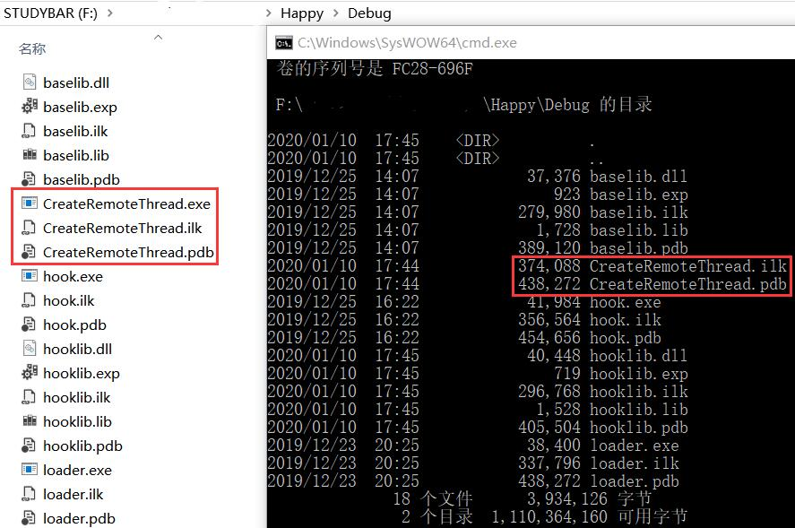

# API Hook

### 实验过程

**修改`hahaha`变成`hehehe`**

- 将原`WriteFlie`函数的地址替换为`Fake_WriteFile`函数的地址
    ```c
    // hook-WriteFile.c
    #include<Windows.h>

    // 函数定义在 IATHook.c 中
    LONG IATHook(
        __in_opt void* pImageBase,
        __in_opt char* pszImportDllName,
        __in char* pszRoutineName,
        __in void* pFakeRoutine,
        __out HANDLE* phHook);

    void* GetIATHookOrign(__in HANDLE hHook);

    HANDLE g_hHook_WriteFile = NULL;
    typedef BOOL(__stdcall * LPFN_WriteFile)(HANDLE hFile, LPCVOID lpBuffer, DWORD nNumberOfBytesToWrite,
        LPDWORD lpNumberOfBytesWritten, LPOVERLAPPED lpOverlapped);

    BOOL __stdcall Fake_WriteFile(HANDLE hFile, LPCVOID lpBuffer, DWORD nNumberOfBytesToWrite,
        LPDWORD lpNumberOfBytesWritten, LPOVERLAPPED lpOverlapped)
    {
        LPFN_WriteFile fnOrigin = (LPFN_WriteFile)GetIATHookOrign(g_hHook_WriteFile);

        if (strcmp(lpBuffer, "hahaha") == 0)
            lpBuffer = "hehehe";

        // 调用原始的 WriteFile 函数
        return fnOrigin(hFile, lpBuffer, nNumberOfBytesToWrite, lpNumberOfBytesWritten, lpOverlapped);
    }

    BOOL WINAPI DllMain(
        HINSTANCE hinstDLL,  // handle to DLL module
        DWORD fdwReason,     // reason for calling function
        LPVOID lpReserved)  // reserved
    {
        // Perform actions based on the reason for calling.
        switch (fdwReason)
        {
        case DLL_PROCESS_ATTACH:
            // Initialize once for each new process.
            IATHook(
                GetModuleHandleW(NULL),
                "kernel32.dll",
                "WriteFile",
                Fake_WriteFile,
                &g_hHook_WriteFile
            );
            // Return FALSE to fail DLL load.
            break;
        }
        return TRUE;  // Successful DLL_PROCESS_ATTACH.
    }
    ```

**dir遍历，越过显示指定文件**

- 钩取`FindNextFileW`函数
  ```c
  // 类似 hook-WriteFile.c，编写 Fake_FindNextFileW 函数
  HANDLE g_hHook_FindNextFileW = NULL;
  typedef BOOL(__stdcall* LPFN_FindNextFileW)(HANDLE hFindFile, LPWIN32_FIND_DATAW lpFindFileData);

  BOOL WINAPI Fake_FindNextFileW(HANDLE hFindFile, LPWIN32_FIND_DATAW lpFindFileData)
  {
	  LPFN_FindNextFileW fnOrigin = (LPFN_FindNextFileW)GetIATHookOrign(g_hHook_FindNextFileW);
	  BOOL status = fnOrigin(hFindFile, lpFindFileData);
	  if (wcscmp(lpFindFileData->cFileName, L"CreateRemoteThread.exe") == 0)
      // 当遇到文件名为 CreateRemoteThread.exe 的文件，就再获取下一个，这样就越过了
		  status = fnOrigin(hFindFile, lpFindFileData);
	  return status;
  }

  // 修改 DLLMain 中调用 IATHook 函数的传入参数
  IATHook(
		GetModuleHandleW(NULL),
		"API-MS-WIN-CORE-FILE-L1-1-0.dll",
		"FindNextFileW",
		Fake_FindNextFileW,
		&g_hHook_FindNextFileW
  );
  ```
  
- 结果

  

